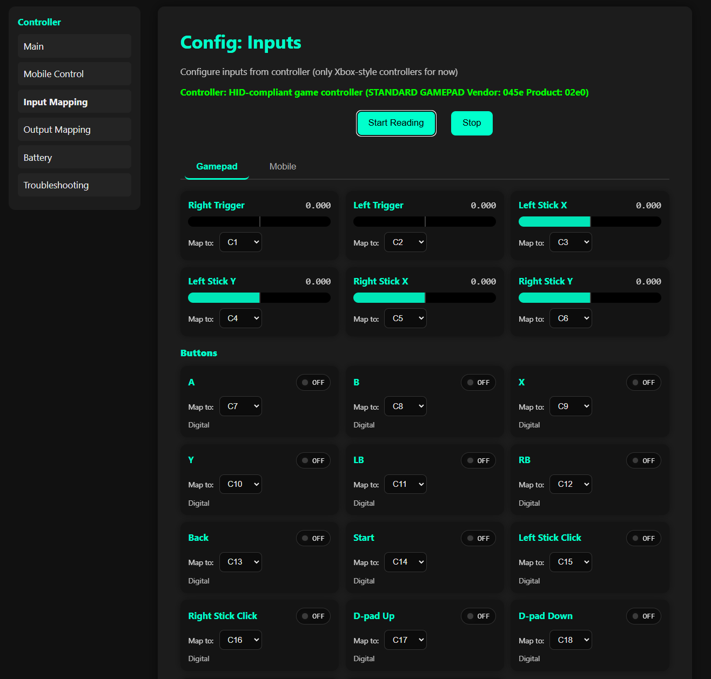
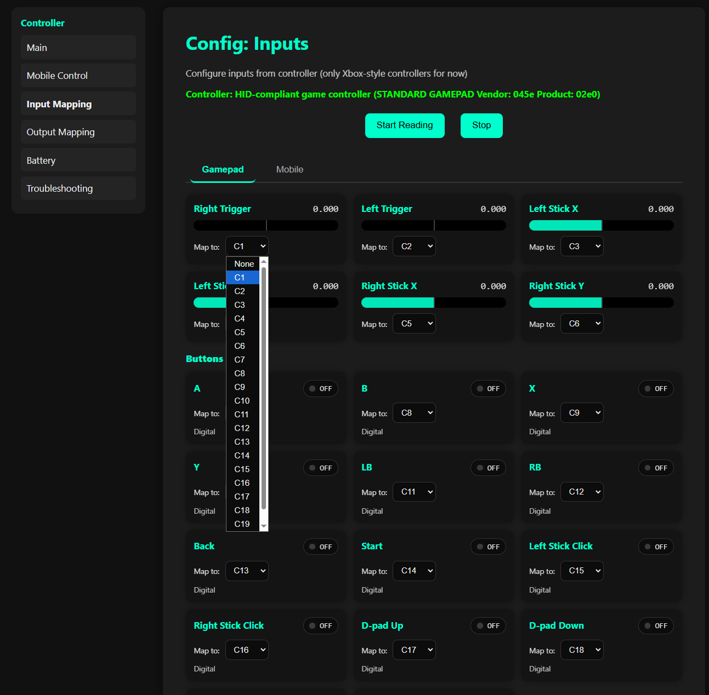
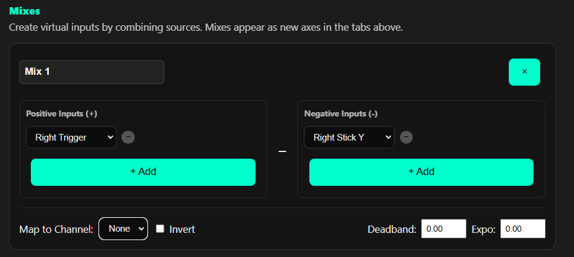
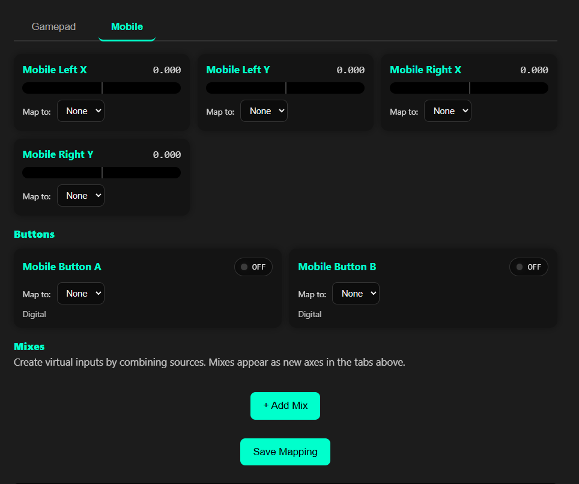
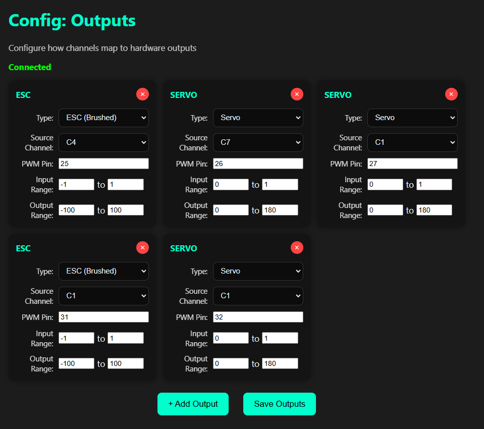
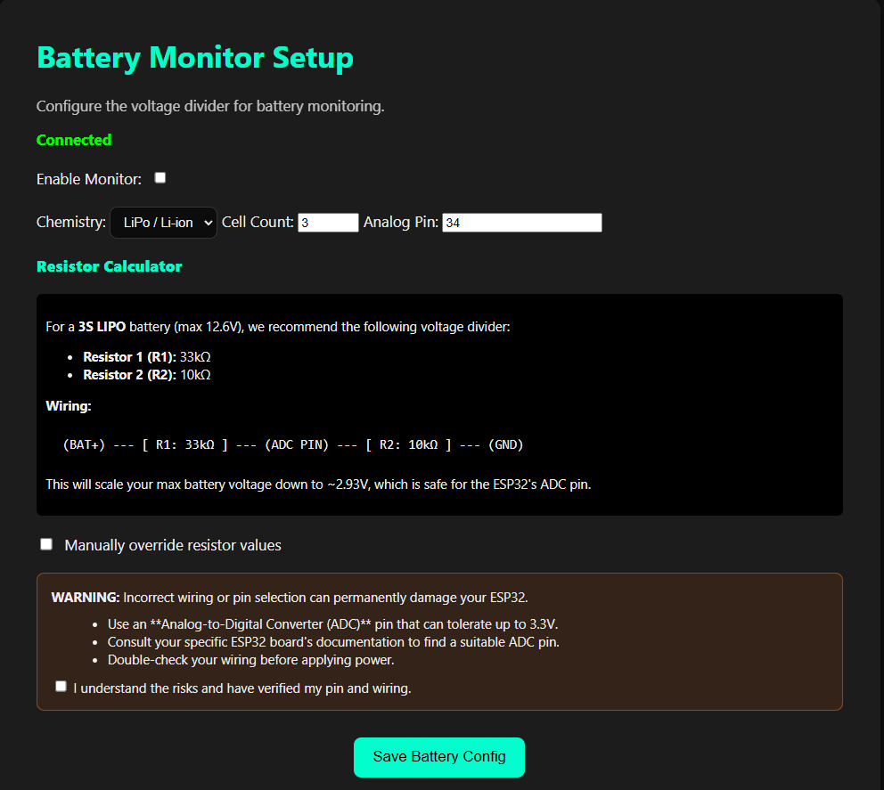
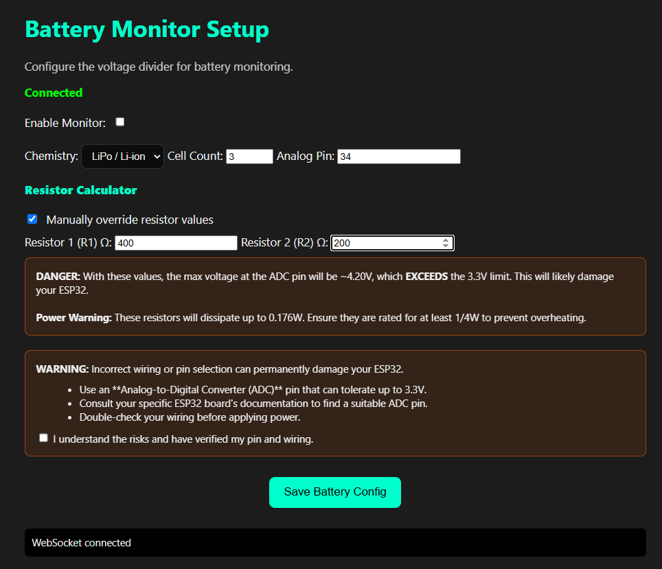

# ESP32 Universal WiFi Gamepad Controller

This project turns an ESP32 into a high-performance, standalone WiFi controller that can be operated in real-time from a web browser using a standard USB gamepad. It's designed to be a flexible and robust foundation for robotics, RC vehicles, and other remote control applications.

## Getting Started

1.  **Clone the repository** and open it in VS Code with the PlatformIO extension.
2.  **Connect your ESP32** to your computer via USB.
3.  **Upload Firmware:** Use the PlatformIO "Upload" task (`Ctrl+Alt+U`).
    > **Note:** This compiles and flashes the C++ code to the ESP32.
4.  **Upload Filesystem:** Use the PlatformIO "Upload Filesystem Image" task.
    > **Note:** This bundles the contents of the `data/` directory into a LittleFS image and flashes it to the ESP32. You must upload the filesystem image at least once. If you only change the C++ code, you only need to upload the firmware. If you change any HTML, CSS, or JS files, you must re-upload the filesystem image.
5.  **Identify Your Controller:** If the controller is factory fresh (or unmodified), it will scan the local networks and assign itself a unique number (e.g. `ESP32Controller-1`). The onboard LED will flash to indicate its number (e.g., 1 flash, pause, repeat). 
6.  **Connect to WiFi:** On your computer or phone, find and connect to the WiFi network named **`ESP32Controller-1`** (or whatever number it flashed). The default password is **`12345678`**.
7.  **Open a web browser** (Chrome or Firefox recommended) and navigate to `http://192.168.4.1`.

## Overview

The ESP32 creates its own WiFi Access Point, allowing you to connect directly to it with a computer or phone without needing an external router. Once connected, you can navigate to a web page served by the ESP32. This web interface reads inputs from a gamepad connected to your computer and streams the control data to the ESP32 over a low-latency WebSocket connection.

The system is highly configurable, with a dedicated web page for mapping gamepad buttons and axes to specific output channels. This configuration is saved directly on the ESP32's filesystem.

## Features

- **Standalone Access Point:** No external WiFi network required.
- **Dual Control Modes:** Use a physical USB gamepad from a computer or on-screen virtual joysticks on a mobile device.
- **Asynchronous Web Server:** High-performance, non-blocking server capable of handling multiple connections.
- **Configurable Input System:**
    - Map any gamepad or mobile input to one of 20 control channels.
    - Apply transformations like **deadband** and **expo** to fine-tune axis response.
    - Create complex **mixes** that combine multiple inputs into a single virtual control.
- **Configurable Output System:**
    - Map control channels to physical hardware outputs (ESCs, Servos).
    - Define input-to-output scaling (e.g., map a channel's `-1` to `1` range to a servo's `0` to `180` degree range).
- **Battery Monitoring:** Configure and monitor battery voltage with a dedicated setup page and status indicators on control pages.
- **Troubleshooting Page:** Dedicated page with diagnostic tools (ping, heap, remote restart).
- **Real-Time Control:** Low-latency control data is sent using an efficient binary WebSocket protocol.
- **Browser-Based Gamepad Support:** Uses the standard web Gamepad API to read controller inputs.
- **Persistent Configuration:** All input, output, battery, and Wi-Fi settings are saved to JSON files (`controlMap.json`, `outputMap.json`, `battery.json`, `wifi.json`) on the ESP32's `LittleFS` filesystem.
- **Auto-Initialization for Fleets:** Deploying multiple fresh boards at once will cause them to automatically scan the local airspace and assign themselves unique network numbers (`ESP32Controller-1`, `-2`, etc.), complete with visual LED flash codes.
- **Built-in Failsafe:** The ESP32 code includes a timeout to detect connection loss and can trigger a failsafe state (e.g., stop motors).
- **Modular Codebase:** Both the C++ firmware and the frontend JavaScript are broken into logical, maintainable modules.

## How It Works

The project consists of two main parts: the ESP32 firmware and the client-side web application.

### ESP32 Firmware (`src/`)

The C++ code running on the ESP32 is responsible for:
1.  **WiFi AP:** Creates a WiFi network with the SSID `ESP32Controller`.
2.  **Web Server:** An `ESPAsyncWebServer` instance serves the static web files (`.html`, `.css`, `.js`) from the `LittleFS` filesystem.
3.  **WebSocket Server:** An `AsyncWebSocket` server listens for incoming client connections on the `/ws` endpoint. It's built to handle specific JSON commands (like saving a configuration) and to receive the main binary control packets.
4.  **Control Loop:** The main `loop()` runs a 100Hz control tick. It reads the latest channel data, checks for a stale connection (failsafe), and tells the `OutputManager` to drive the hardware.
5.  **Sensor Loop:** A 10Hz loop reads the `BatteryMonitor` and broadcasts the status to all connected web clients.

### Web Application (`data/`)

The HTML, CSS, and JavaScript files run in the client's web browser.

1.  **Connection:** The JavaScript connects to the ESP32's WebSocket server.
2.  **Control Pages (`/` and `/mobile`):** These pages read either a physical gamepad or virtual joysticks, apply all configured mixes and transformations from `controlMap.json`, and stream the final channel values to the ESP32.
3.  **Configuration Pages (`/config/inputs`, `/config/outputs`, `/battery`):** These provide UIs to modify the system's behavior. When you save, the new configuration is sent to the ESP32, which overwrites the corresponding JSON file on its filesystem and restarts to apply the changes.

## Detailed Setup and Configuration

After the initial firmware and filesystem upload, you can configure the system using the web interface.

### 1. WiFi Access Point Configuration

Navigate to `http://192.168.4.1/settings` in your browser. This page allows you to change the Wi-Fi credentials for your ESP32 Access Point.

1. **SSID:** Enter the desired network name (e.g., "MyRobot").
2. **Password:** Enter a password (must be at least 8 characters) or leave it blank to create an open network.
3. **Save & Restart:** Once you hit save, the new credentials will be written to `wifi.json` and the ESP32 will instantly reboot. You will need to reconnect to the new Wi-Fi network.

> **Note on Multiple Controllers:** If you deploy multiple fresh ESP32s at the same time, their built-in `DeviceInitializer` will automatically scan the area and assign each a unique number (`ESP32Controller-1`, `ESP32Controller-2`, etc.) so they don't conflict out of the box! Their onboard LED will flash to visually tell you which board is which. Once you configure them via the Settings page, this auto-numbering is disabled.

### 2. Input Mapping (Gamepad & Mobile)

Navigate to `http://192.168.4.1/config/inputs` in your browser. This page allows you to map physical gamepad inputs or virtual mobile joystick inputs to the 20 available control channels.

**<center></center>**

#### Gamepad Inputs

1.  **Start Gamepad Live View:** Click "Start Reading" to activate the gamepad polling. Connect your gamepad to your computer and press some buttons/move sticks to see the live values update on the cards.
2.  **Map to Channel:** For each input (e.g., "Left Stick X", "A Button"), select the desired control channel from the "Map to:" dropdown. Unselected inputs will not send data.
    **<center></center>**
3.  **Transformations (Deadband, Expo, Invert):**
    *   **Deadband:** Reduces sensitivity around the center of an axis, ignoring small movements. Set a value (e.g., 0.04) to create a "dead zone."
    *   **Expo:** Adjusts the stick response curve. Positive expo makes the center less sensitive and the ends more sensitive, while negative expo makes it more sensitive around the center.
    *   **Invert:** Reverses the direction of an axis.
    **<center></center>**

#### Mobile Inputs

Switch to the "Mobile" tab on the inputs configuration page. Here you can configure the virtual joysticks and buttons available on the `/mobile` page.

**<center></center>**


### 3. Output Configuration

Navigate to `http://192.168.4.1/config/outputs` in your browser. This page allows you to define and configure the physical outputs connected to your ESP32, such as ESCs (Electronic Speed Controllers) for motors or Servos.

**<center></center>**

1.  **Add Output:** Click the "Add Output" button to create a new output configuration.
2.  **Configure Output:**
    *   **Type:** Select `ESC (Brushed)` or `Servo`. This determines the default pulse ranges and frequency.
    *   **Source Channel:** Select which control channel (1-20) will drive this output.
    *   **PWM Pin:** Enter the GPIO pin number on your ESP32 where this output is connected.
    *   **Input Range:** Defines the expected range of values from the source channel (typically -1 to 1 for axes, 0 to 1 for buttons).
    *   **Output Range:** Defines the desired output value range for your hardware (e.g., 0 to 180 for a servo in degrees, -100 to 100 for an ESC's speed).


3.  **Save Changes:** After configuring all outputs, click the "Save Outputs" button. This will save the `outputMap.json` file to the ESP32's filesystem and the ESP32 will restart to apply the changes.

### 4. Battery Monitoring Setup

Navigate to `http://192.168.4.1/battery` in your browser. This page allows you to configure the battery monitoring system.

**<center></center>**

1.  **Enable Monitoring:** Check the "Enable Battery Monitoring" checkbox.
2.  **Chemistry & Cell Count:** Select your battery's chemistry (LiPo or LiFePO4) and the number of cells (e.g., 3S, 4S). This helps in calculating voltage percentages.
3.  **ADC Pin:** Enter the GPIO pin number on your ESP32 where the voltage divider output is connected.
4.  **Voltage Divider Resistors (R1, R2):**
    *   The page provides a recommendation for R1 and R2 values based on your battery configuration to safely scale the battery voltage down to the ESP32's 3.3V ADC input.
    *   **Wiring:** Connect `(BAT+) --- [ R1 ] --- (ADC PIN) --- [ R2 ] --- (GND)`.
    *   **Override:** If you have existing resistors or specific requirements, you can check "Override Recommended Resistors" and manually enter R1 and R2 values. Be **extremely careful** here, as incorrect values can damage your ESP32's ADC pin if the voltage exceeds 3.3V. The UI will provide warnings if potential damage is detected.
    **<center></center>**
5.  **Acknowledge Risk:** Read the warning about potential damage and check the "I understand the risk..." checkbox to enable the Save button.
6.  **Save Changes:** Click "Save Battery Config". This will save the `battery.json` file to the ESP32's filesystem and the ESP32 will restart to apply the changes.

---

## File Structure

```text
Wifi_Control/
├── .gitignore
├── .pio/
├── .vscode/
│   ├── extensions.json
│   ├── c_cpp_properties.json
│   └── launch.json
├── data/
│   ├── app.js
│   ├── battery.html
│   ├── battery.json
│   ├── BatteryMonitor.cpp
│   ├── BatteryMonitor.h
│   ├── config_inputs.html
│   ├── config_outputs.html
│   ├── controlMap.js
│   ├── controlMap.json
│   ├── gamepad.js
│   ├── index.html
│   ├── mobile.html
│   ├── nipplejs.js
│   ├── outputMap.json
│   ├── page-battery.js
│   ├── page-config-inputs.js
│   ├── page-config-outputs.js
│   ├── page-index.js
│   ├── page-mobile.js
│   ├── page-settings.js
│   ├── page-troubleshooting.js
│   ├── settings.html
│   ├── style.css
│   ├── troubleshooting.html
│   ├── utils.js
│   ├── websocket.js
│   └── wifi.json
├── include/
│   └── README
├── lib/
│   └── README
├── platformio.ini
├── README.md
├── src/
│   ├── initializer/
│   │   ├── DeviceInitializer.cpp
│   │   └── DeviceInitializer.h
│   ├── main.cpp
│   ├── networkAndWebserver/
│   │   ├── ProjectWsCommands.cpp
│   │   ├── ProjectWsCommands.h
│   │   ├── StaticFileServer.cpp
│   │   ├── StaticFileServer.h
│   │   ├── WifiAPConfig.h
│   │   ├── WsCommandServer.cpp
│   │   └── WsCommandServer.h
│   ├── outputs/
│   │   ├── OutputManager.cpp
│   │   └── OutputManager.h
│   └── sensors/
│       ├── BatteryMonitor.cpp
│       └── BatteryMonitor.h
└── test/
    └── README
```

## Troubleshooting

The web interface includes a "Troubleshooting" page with the following features:

-   **Ping:** Test the connection to the ESP32.
-   **Heap:** Check the available memory on the ESP32.
-   **Restart:** Remotely restart the ESP32.

## Dependencies

This project relies on the following PlatformIO libraries, which are managed automatically via `platformio.ini`:

-   `bblanchon/ArduinoJson@^7`
-   `https://github.com/ESP32Async/AsyncTCP.git`
-   `https://github.com/ESP32Async/ESPAsyncWebServer.git`

## Contributing

Contributions are welcome! Please open an issue or submit a pull request on the GitHub repository.

## License

This project is licensed under the MIT License. See the `LICENSE` file for details.
